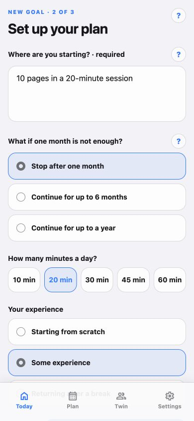

# Actum

[](https://github.com/pol4xer/Actum/actions/workflows/ci.yml)

**Turn a personal goal into a daily quest.**

Actum is an iPhone-first life RPG that connects AI-assisted planning with the work of following a plan. Set a measurable goal, record your starting point, and choose a daily time budget. Actum researches the goal, builds a 30-day program, and guides each session with built-in timers, counters, checklists, and a progress journal.

**Status: local MVP.** This repository contains the app and its local AI gateway. There is no hosted service or store release. The interface and newly generated plans are in English; the web version provides a way to explore the UI.

<p>
  
  
</p>

*Actual English screens from the web export at phone width, using example data. Native iOS presentation differs.*

## The product loop

```text
Goal + baseline + time budget
             ↓
Research with sources → validated 30-day plan → review and accept
                                                   ↓
                                   Daily quest → result → check-in
                                                   ↓
                                 Progress, XP, and session history
                                                   ↓
                         Assessment → explicitly request the next cycle
```

- **Plan a program:** choose a continuation limit of 1, 6, or 12 months, with a roadmap and detailed assignments for the current 30-day cycle.
- **Do the work inside the app:** follow measurable timer and counter exercises, with supporting checklists and text responses. Timers retain actual work beyond the planned duration.
- **Keep the evidence:** save session checkpoints, measured results, comments, and completion status locally. Resume an interrupted session without losing its progress.
- **See both kinds of progress:** track the current cycle and the overall goal alongside XP, levels, energy, streaks, and a comparison with the accepted plan.
- **Adapt deliberately:** use the cycle assessment to request the next month. Research is reused across the program; another paid planning request requires an explicit action.

## Engineering decisions

| Area | Implementation |
| --- | --- |
| Client | Expo SDK 57, React Native 0.86, React 19.2, TypeScript, Expo Router |
| Boundaries | Thin routes, feature modules with public APIs, a platform-independent domain layer, and automated dependency checks |
| Session execution | A deterministic state machine with an injected clock, persisted checkpoints, and timer recovery |
| Local state | Reducer and application commands, versioned codecs and migrations, serialized writes; AsyncStorage on native and localStorage on web |
| AI integration | A Node.js gateway using the OpenAI Responses API; separate research and structured planning stages |
| Validation | Server JSON Schema, independent semantic validation, client Zod contracts, and contract parity tests |
| Request recovery | Durable state written before paid requests, saved response IDs, resumable polling, and versioned caches |
| Native experience | Local reminders, haptics, and an iOS-focused visual system with platform adapters |

The validator checks more than JSON shape: day numbering, measurable assignments, baseline arithmetic, daily time limits, and consistency between the roadmap and assessment. An uncertain provider request is guarded against an automatic duplicate charge.

```text
src/app → src/features → src/state → src/domain
               ↓            ↓
         shared UI      platform adapters

scripts/ai-server.mjs → research / contracts / provider / durable state
```

See the [architecture](docs/ARCHITECTURE.md) and [product scope](docs/PRODUCT_SCOPE.md) for detailed design notes in Russian.

## Run locally

Use **Node.js 22.22.3** (`.nvmrc`) and **pnpm 11.9.0** (`packageManager` in `package.json`). Node 22.13 is the declared minimum. The web UI does not require Xcode or an API key to open.

```bash
git clone https://github.com/pol4xer/Actum.git
cd Actum
nvm install
nvm use
npm install --global pnpm@11.9.0
pnpm install --frozen-lockfile
cp .env.example .env.local
pnpm web
```

If you use another Node version manager, select the version in `.nvmrc`. If pnpm is already available at the pinned version, skip its installation.

**To generate a plan**, add your own `OPENAI_API_KEY` to `.env.local`, review the model configuration in that file, and start the gateway in a second terminal:

```bash
pnpm ai:server
```

The default local gateway address is `http://127.0.0.1:8787`. Research and planning call a paid external API. The key belongs only in the server environment: Expo embeds `EXPO_PUBLIC_*` values into the client bundle, so those variables must never contain secrets. Goal inputs are sent to OpenAI when planning; accepted plans and session history are stored locally.

**For iOS development**, use macOS with Xcode and an installed iOS Simulator. Start the gateway as above, then build the native development app:

```bash
pnpm ios
```

Use `pnpm start` for later Metro sessions and rebuild after changing native dependencies. The [development guide](docs/DEVELOPMENT.md) covers the optional macOS launcher, physical devices, runtime configuration, request recovery, and EAS setup. Android has a build command (`pnpm android`), but iOS is the primary development target; a successful web export does not verify native behavior.

## Checks

```bash
pnpm typecheck  # TypeScript
pnpm test:ai    # Domain, state, contracts, architecture, and gateway tests
pnpm check     # Both checks above, then a production web export
```

The automated gateway tests use a fake provider and do not make paid OpenAI requests. They cover request failures and recovery, cache behavior, contract parity, migrations, session execution, and module boundaries. These commands do not replace a native device walkthrough.

## Current limits

- One active goal, local storage, and no accounts or cross-device synchronization.
- AI planning requires the local gateway and a compatible model available to your API account. The gateway is a development service without production authentication or deployment infrastructure.
- Detailed assignments cover the current 30-day cycle; later cycles are generated explicitly from updated results.
- The runner currently supports numeric goals achieved by reaching or exceeding a target; recognized decreasing-target goals are rejected before paid planning.
- HealthKit, widgets, App Intents, and a distributed mobile release are outside the current MVP.

The next product step is to validate daily use and cycle transitions, then provide a secured hosted backend for distribution. See [product scope](docs/PRODUCT_SCOPE.md) for the existing roadmap.

## License

[MIT](LICENSE). Copyright 2026 pol4xer; the Expo starter's license notice is retained.
